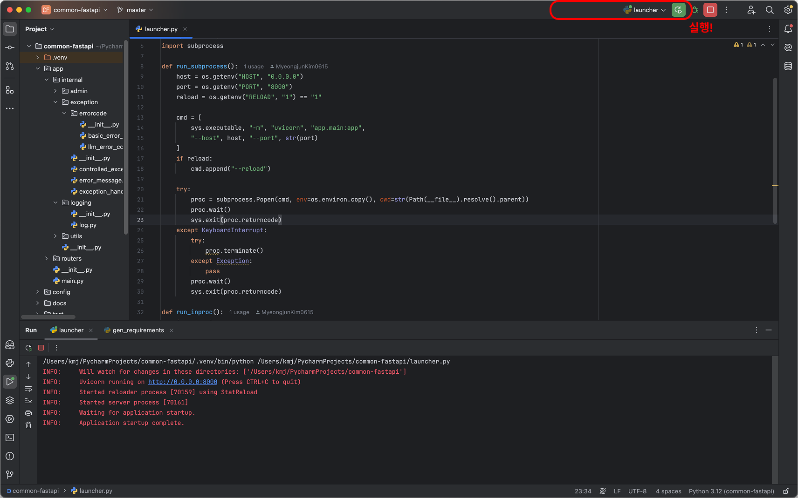

# FastAPI Project Template
- FashAPI를 쉽고 빠르게 생성하기 위한 템플릿
1. 알고 있는 FashAPI 기술을 모두 접목
2. 존재하는 모든 코드에 주석으로 설명 작성

# Settings
## Step 1. Download Python3

## Step 2. Launch PostgreSQL
1. 본 프로젝트는 PostgreSQL를 활용합니다. `.env`에 본인의 계정 정보를 추가해주세요.
```markdown
DB_HOST={your_database_host}
DB_NAME={your_database_name}
DB_USER={your_database_user}
DB_PASSWORD={your_database_password}
DB_PORT={your_database_port}

MODEL_VERSION='qwen3:4b'
```
2. develop_database 데이터베이스 생성
- PostgreSQL에 develop_database를 생성하세요.
> 자동으로 생성되기를 원하면 테이블 생성 권한이 있는 DB_USER를 이용하세요. 

## Step 3. Launch Milvus
1. 본 프로젝트는 MilvusLite를 활용합니다. `.env`에 본인의 계정 정보를 추가해주세요.
```markdown
# TODO
```

## Step 3. 실행여부 확인
- 직접 접속해보세요! [Swagger UI 바로가기](http://localhost:8000/docs)

# How to Install
## from PyCharm
- PyCharm IDEA Ultimate
1. CommonSpringbootApplication.java로 이동한다.


## 2. from JAR
- TODO

## 3. from Docker
- TODO

# API Documentation
- [Swagger UI](http://localhost:8000/docs)

# Directory Structure
- [Directory Strategy](docs/strategy/directory)

# Git Strategy
### Branch Strategy
- [Branch Strategy](docs/strategy/branch)

### PR Strategy
- [Pull Request Strategy](docs/strategy/pull-request)

### Issue Strategy
- [Issue Strategy](docs/strategy/issue)

# Dependency & Library
| Name                                | Description                                                                                                                                                                                                                      | Version  |
|-------------------------------------|----------------------------------------------------------------------------------------------------------------------------------------------------------------------------------------------------------------------------------|----------|

# Support
### E-Mail
- aduwnssp@gmail.com

### Contributer
| Name | Role   | Description | Link                                                             |
|------|--------|-------------|------------------------------------------------------------------|
| 김명준  | Writer | 김명준입니다.     | [gomj Repository](https://github.com/gomj-repo?tab=repositories) |

# License
|Name|License|CopyRight|
|---|---|---|
|name|license|copy_right|